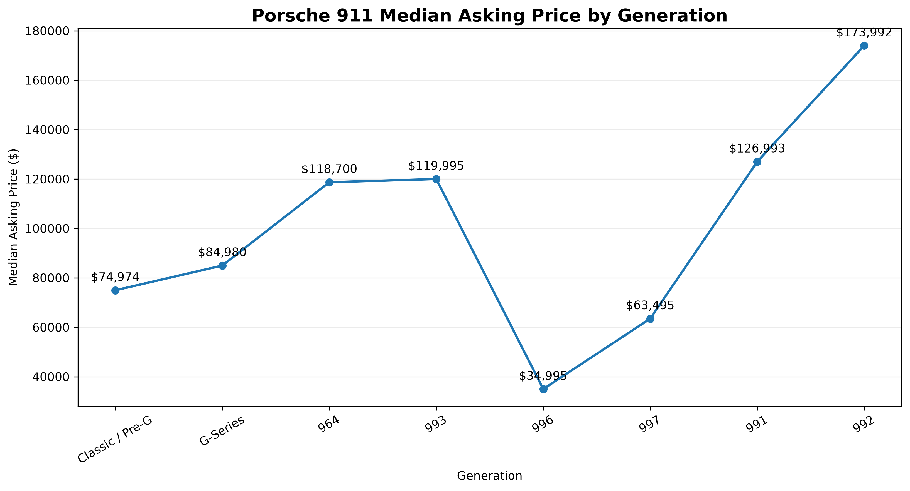
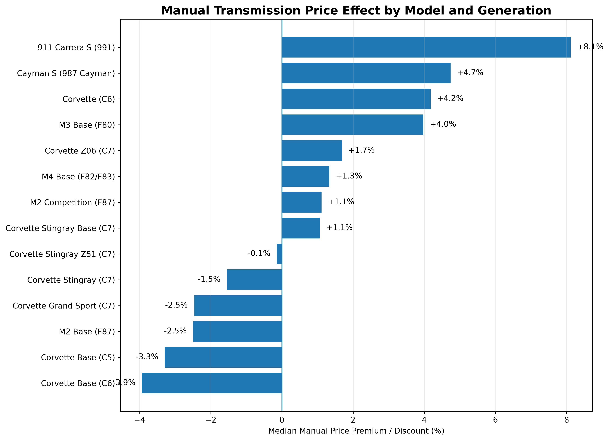
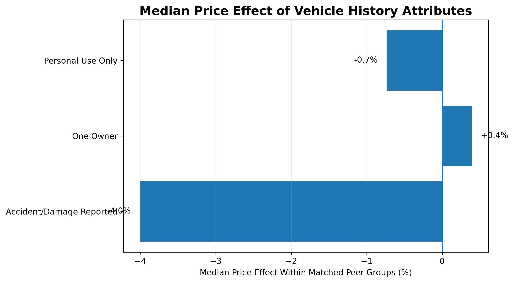
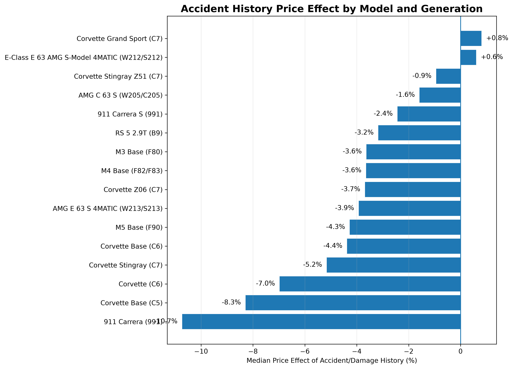
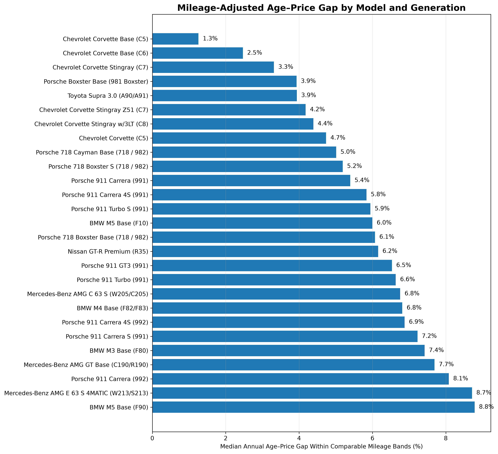
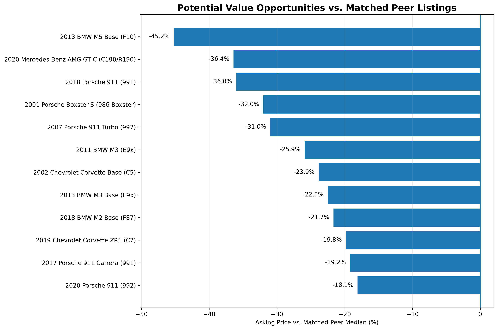

# Apex Analytics

### Enthusiast Vehicle Market Intelligence

Apex Analytics is an end-to-end data analytics portfolio project examining the U.S. enthusiast and performance-car market using used-vehicle listing data.

The project combines **Python, PostgreSQL, SQL, statistical analysis, and Tableau** to study how vehicle generation, mileage, transmission type, accident history, ownership history, age, and other enthusiast-relevant characteristics relate to asking prices.

> **Interactive Dashboard:** [View Apex Analytics on Tableau Public](https://public.tableau.com/app/profile/aniket.christi/viz/Apex_Analytics_Dashboard/ApexAnalyticsDashboard)

---

## Project Overview

The source dataset contained more than **762,000 used-vehicle listings**.

After auditing the data and defining an enthusiast/performance scope, the final analytical dataset contains:

- **10,480 unique listings**
- **8 manufacturers**
- **22 enthusiast model families**
- **40 analytical fields**
- Multiple generations spanning classic and modern performance cars

The dataset includes vehicles from **BMW, Mercedes-Benz, Porsche, Audi, Chevrolet, Toyota, Nissan, and Cadillac**.

Examples include the BMW M2/M3/M4/M5, Mercedes-AMG C63 and AMG GT, Porsche 911 and Cayman/Boxster, Chevrolet Corvette, Toyota Supra, Nissan GT-R, Audi RS models, and Cadillac Blackwing models.

---

## Business Questions

Apex Analytics explores questions such as:

- Which enthusiast brands and model families dominate the available market?
- How do asking prices differ across vehicle generations?
- Do manual transmissions consistently command a price premium?
- How strongly is accident history associated with asking price?
- Do one-owner or personal-use-only vehicles command meaningful premiums?
- Which models show stronger age-related price retention after accounting for mileage?
- Which listings appear inexpensive relative to closely matched peers?

---

## Tech Stack

- **Python 3.12**
- **Pandas**
- **NumPy**
- **Matplotlib**
- **PostgreSQL 18**
- **SQL**
- **Tableau Public**
- **JupyterLab**
- **Git & GitHub**

---

## Data Pipeline

### 1. Data Audit

The raw dataset was evaluated for:

- manufacturer and model coverage
- missing values
- duplicate listings
- inconsistent categorical fields
- transmission and drivetrain information
- vehicle-history attributes
- mileage and price distributions
- enthusiast-model sample sizes

### 2. Data Cleaning

The Python cleaning pipeline:

- selected enthusiast and performance vehicle families
- standardized model-family names
- mapped vehicles to generations
- normalized transmission and drivetrain categories
- parsed engine displacement and cylinder information
- parsed MPG values
- removed exact duplicate copies
- created analytical quality flags
- preserved source-row identifiers for traceability

The final dataset contains **10,480 unique listings × 40 fields**.

Ambiguous generation mappings were preserved with explicit quality flags instead of being silently forced into a generation.

Mileage values of `0` were also preserved in the source data but excluded from mileage-dependent analysis because they appeared to represent placeholder values.

---

## SQL Analysis

The cleaned dataset was loaded into PostgreSQL and analyzed through a structured SQL workflow.

| SQL File | Purpose |
| --- | --- |
| `01_create_schema.sql` | Database schema and table creation |
| `02_validate_import.sql` | Import validation and quality checks |
| `03_market_overview.sql` | Manufacturer and model-family overview |
| `04_generation_analysis.sql` | Generation-level pricing analysis |
| `05_value_analysis.sql` | Peer-adjusted potential value opportunities |
| `06_transmission_analysis.sql` | Manual vs. automatic price effects |
| `07_vehicle_history_analysis.sql` | Accident and ownership-history effects |
| `08_depreciation_analysis.sql` | Mileage-adjusted age-price retention |

---

## Analytical Methodology

Several analyses use **matched peer groups** rather than comparing unrelated vehicles.

Listings are matched using combinations of:

- manufacturer
- exact model
- generation
- model year
- mileage band

Mileage bands are:

`0–9k`, `10–24k`, `25–49k`, `50–74k`, `75–99k`, and `100k+`.

Minimum sample sizes and interquartile-range safeguards were used to reduce the influence of sparse or highly dispersed peer groups.

---

## Key Findings

### Generation-Level Pricing

The Porsche 911 illustrates how enthusiast pricing does not necessarily move smoothly across generations.

The 996 generation has a substantially lower median asking price than both the preceding 993 and succeeding 997 generations.



---

### Manual Transmission Premium

Manual transmissions do **not** command a universal enthusiast-market premium.

Selected matched-peer results include:

- Porsche 911 Carrera S (991): approximately **+8.1%**
- Porsche Cayman S (987): approximately **+4.7%**
- Chevrolet Corvette C6: approximately **+4.2%**
- BMW M3 F80: approximately **+4.0%**

Several other Corvette and BMW groups showed little premium or modest discounts.

The results suggest that manual-transmission value is highly **model-specific**.



---

### Vehicle History

Accident or damage history showed the clearest systematic association with asking price.

Across qualified matched peer groups:

- **Accident/damage reported:** approximately **-4.0%**
- **One-owner status:** approximately **+0.4%**
- **Personal-use-only status:** approximately **-0.7%**

One-owner and personal-use labels were nearly neutral after matching comparable vehicles.



Model-level analysis showed larger accident-associated discounts for some Porsche 911, Corvette, BMW M, Mercedes-AMG, and Audi RS groups.



---

### Mileage-Adjusted Age-Price Retention

Because this dataset is a cross-section of current asking prices rather than repeated historical transactions, this project does **not** claim to measure literal depreciation.

Instead, it evaluates the relationship between model year and asking price **within comparable mileage ranges**.

Smaller annual age-price gaps suggest stronger cross-sectional price retention.

Examples of relatively small age-related gaps include:

- Chevrolet Corvette Base C5 — **1.3%**
- Chevrolet Corvette Base C6 — **2.5%**
- Chevrolet Corvette Stingray C7 — **3.3%**
- Porsche Boxster Base 981 — **3.9%**
- Toyota Supra 3.0 A90/A91 — **3.9%**

Examples of larger age-related gaps include:

- Porsche 911 Carrera 992 — **8.1%**
- Mercedes-AMG E63 S W213/S213 — **8.7%**
- BMW M5 F90 — **8.8%**



---

### Potential Value Opportunities

Potential value candidates were identified by comparing listings with tightly matched peers.

Candidates must:

- belong to a peer group with at least five listings
- have limited peer-price dispersion
- remain within IQR-based price bounds
- have no reported accident/damage history
- avoid known transmission or drivetrain source inconsistencies
- be priced below the peer median

These should be interpreted as **potential value opportunities**, not confirmed undervalued vehicles. Condition, options, title status, geography, and other unobserved factors may explain part of the price difference.



---

## Interactive Tableau Dashboard

The Tableau dashboard provides an interactive view of the cleaned enthusiast-car market.

It includes:

- median asking price by manufacturer
- listing volume by manufacturer
- largest enthusiast model families
- generation-level price exploration
- asking price vs. mileage analysis
- shared model-family filtering
- listing-level hover information

### Live Dashboard

**[Open Apex Analytics on Tableau Public](https://public.tableau.com/app/profile/aniket.christi/viz/Apex_Analytics_Dashboard/ApexAnalyticsDashboard)**

The Tableau workbook is stored in:

`dashboard/Apex_Analytics_Dashboard.twb`

---

## Repository Structure

```text
Apex-Analytics/
├── dashboard/
│   └── Apex_Analytics_Dashboard.twb
├── data/
│   ├── raw/
│   └── processed/
├── docs/
│   └── figures/
├── notebooks/
│   ├── 01_data_audit.ipynb
│   ├── 02_data_cleaning.ipynb
│   └── 03_market_analysis.ipynb
├── sql/
│   ├── 01_create_schema.sql
│   ├── 02_validate_import.sql
│   ├── 03_market_overview.sql
│   ├── 04_generation_analysis.sql
│   ├── 05_value_analysis.sql
│   ├── 06_transmission_analysis.sql
│   ├── 07_vehicle_history_analysis.sql
│   └── 08_depreciation_analysis.sql
├── src/
├── .gitignore
├── requirements.txt
└── README.md

Workflow
Raw vehicle listings
        ↓
Python feasibility audit
        ↓
Enthusiast vehicle selection
        ↓
Cleaning + generation mapping
        ↓
Processed analytical dataset
        ↓
PostgreSQL / SQL analysis
        ↓
Python validation + visualization
        ↓
Tableau dashboard

The large raw and processed data files are intentionally excluded from Git tracking.

Limitations
Asking prices are not confirmed transaction prices.
The dataset represents a cross-sectional market snapshot.
Observed relationships should not be interpreted as causal effects.
Vehicle condition, options, title status, location, seller characteristics, and other unobserved variables can influence asking price.
Collector vehicles may not follow conventional depreciation patterns.
Mileage-dependent analyses exclude zero-mileage placeholder records.
Project Status

Complete

Data audit → cleaning → PostgreSQL → SQL analysis → Python validation → visualizations → Tableau dashboard → portfolio documentation.

Disclaimer

This project is an independent personal portfolio project created for educational and analytical purposes.

It is not affiliated with any automotive manufacturer, marketplace, dealership, or data provider.
